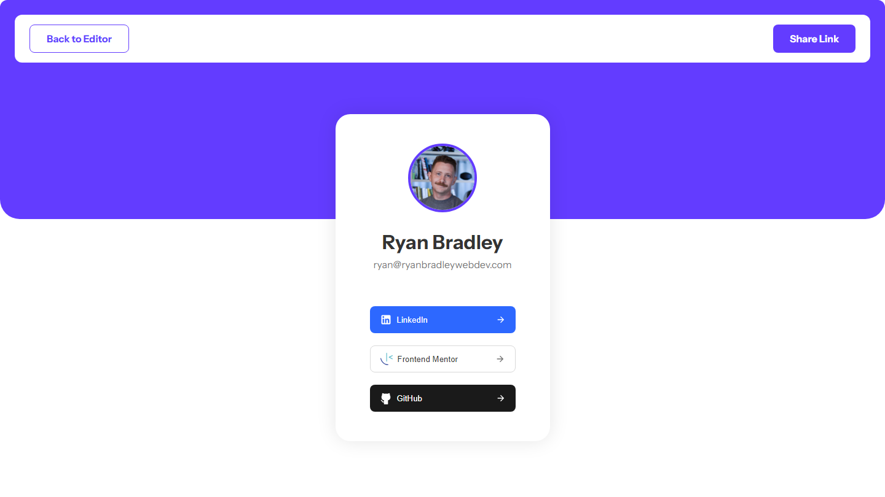

# Frontend Mentor - Link-sharing app solution

This is a solution to the [Link-sharing app challenge on Frontend Mentor](https://www.frontendmentor.io/challenges/linksharing-app-Fbt7yweGsT). Frontend Mentor challenges help you improve your coding skills by building realistic projects.


## Table of contents

- [Overview](#overview)
  - [The challenge](#the-challenge)
  - [Screenshot](#screenshot)
  - [Links](#links)
- [My process](#my-process)
  - [Built with](#built-with)
  - [Architecture](#architecture)
    - [Frontend](#frontend)
    - [Backend](#backend)
    - [Database](#database)
  - [What I learned](#what-i-learned)
  - [Continued development](#continued-development)
  - [Useful resources](#useful-resources)
- [Author](#author)
- [Acknowledgments](#acknowledgments)

## Overview

### The challenge

Users should be able to:

- Create, read, update, delete links and see previews in the mobile mockup
- Receive validations if the links form is submitted without a URL or with the wrong URL pattern for the platform
- Drag and drop links to reorder them
- Add profile details like profile picture, first name, last name, and email
- Receive validations if the profile details form is saved with no first or last name
- Preview their devlinks profile and copy the link to their clipboard
- View the optimal layout for the interface depending on their device's screen size
- See hover and focus states for all interactive elements on the page
- **Bonus**: Save details to a database (build the project as a full-stack app)
- **Bonus**: Create an account and log in (add user authentication to the full-stack app)

### Screenshot


### Links

- Solution URL: [GitHub Repo](https://github.com/ryanbradley-webdev/link-sharing-app)
- Live Site URL: [Link Sharing App](https://link-sharing-app-f3f11.web.app/)

## My process

### Built with

- [React](https://reactjs.org/)
- [Node.js](https://nodejs.org/en)
- [PostgreSQL](https://www.postgresql.org/)

### Architecture

#### Frontend

The front end of this app was built using Vite with the React.js library. The overall page structure is a React Router application wrapped in a React Query Provider and two Context Providers, one for authentication and one for data manipulation.

On initial page load, the application checks for a logged-in user from sessionStorage. If no user exists, the user is redirected to the login screen.


From there, the user can either log in or create an account. On successful authentication, the home page renders a list of links (or a placeholder indicating that no links currently exist). The user can toggle between this page and a "Profile Details" page to update personal information.


Finally, a preview page is provided to view a preview of the current data the user has provided.



The sharable links page is similar to the preview page (in fact, it uses the same display component) however it does not check for user authentication and instead fetches the user's data independently of the application's contexts. This provides a sharable links page to be used on social media or personal websites.

#### Backend

The back end was developed as a Node.js backend utilizing the Express.js library for routing. There are five endpoints for the API: root, /signup, /login, /userInfo, and /links. File structure is organized according to these endpoints:

```
/server
    -server.js ['/', '/signup', '/login' endpoints]
    /routes
        -links.js
        -userInfo.js
```

The root enpoint exposes a GET route for initial loading of the complete user's information. This is used for initial page load and for the sharable page fetch route to get all information at once. However, in using the application to update data, only portions of data are updated at any time. As such, links and user info were split into separate routes to better compartmentalize the database queries.

In /routes/links.js, GET and PATCH routes are exposed to allow updating the user's data and retrieving the updated data on the frontend. The same paradigm is accomplished in the /routes/userInfo.js route but with the remainder of the user's data.

POST enpoints are exposed for /login and /signup, which are used for exactly those purposes. The /login route will simply log the user in and return 'user' and 'session' objects from Supabase. /signup will perform the same function, however before returning the objects it will insert a new row into the userData table of the database to store the new user's data before routing the user to the appropriate page. If either of these routes experience an authentication failure, an error message is returned instead with an appropriate status code. In every case, the response is sent via a 'responseData' object which contains all required information based on the request.

```js
const responseData = {
        user: // Supabase User object,
        session: // Supabase Session object,
        error: // Custom error message or 'null'
    }
```

#### Database

The database is configured in a simple single-table PostgreSQL schema through Supabase. In addition to the provided User table, a userdata table is provided to store all user information. The schema is as follows:

```sql
table userData (
    id: #int8 (@primarykey),
    userId: #uuid (@foreignkey: user.id),
    firstName: #text (NOT NULL),
    lastName: #text (NOT NULL),
    email: #text,
    profileImg: #text,
    slug: #text (UNIQUE, NOT NULL),
    links: #jsonb[]
)
```

User data updates are performed by selectively updating columns according to the user's supplied id. For example, when the user clicks the 'Save' button on the 'Profile Details' page, the information is sent over HTTP to the backend API where the following query is performed (after checking for valid information):

```js
router.patch('/', async (req, res) => {
    const { userId, userInfo } = req.body

    const responseData = {
        success: false,
        error: null
    }

    if (!userId || !userInfo) {
        responseData.error = 'Missing user information'

        return res.status(400).json(responseData)
    }

    try {
        const {
            firstName,
            lastName,
            email,
            profileImg
        } = userInfo

        const {
            error
        } = await supabase
            .from('userData')
            .update({ firstName, lastName, email, profileImg })
            .eq('userId', userId)

        if (error) {
            responseData.error = error

            return res.status(404).json(responseData)
        }

        responseData.success = true

        res.json(responseData)
    } catch (e) {
        responseData.error = e

        res.status(500).json(responseData)
    }
})
```

### What I learned

This project was my first using session-based user authentication. I accomplished this by utilizing sessionStorage in the client to maintain the user data provided by Supabase when the user logs in. From there, the user can refresh the page and navigate to other sites while maintaining logged-in status, however this is broken upon closing the tab or browser.

The most difficult portion of this project was the complex form validation required by the design. For the login and signup pages, I accomplished this by creating a useForm hook to supply validation functions to each component utilizing forms. As an addition to the design, I also added indicators of invalid password use when creating an account. An example of this is below:


This proved most difficult when implementing validation for the link url data. The design required validation that not only was the field not empty, but also that the url matched the required format. This was accomplished by storing links on the client with a ref attribute that was applied to the data when each link was rendered. When the form is saved, each link's ref is passed to a validation method which check's the input's value against the appropriate url template according to the selected platform.


If a mismatch exists, the class 'invalid' is attached to the ref's current node and a data attribute for 'valid-url' is set to false to indicate the specific invalidity. The data attribute and class name are used to set higher specificity with the CSS classes used for invalid inputs, which will set an invalid URL at a higher specificity than a general empty field.

```css
label:has(input.invalid)::after,
label:has(input[data-url='true'].invalid)::after {
    content: 'Can\'t be empty';
}

label:has(input[type='text'][data-valid-url='false'])::after {
    content: 'Please check the URL';
}
```

### Continued development

Use this section to outline areas that you want to continue focusing on in future projects. These could be concepts you're still not completely comfortable with or techniques you found useful that you want to refine and perfect.

**Note: Delete this note and the content within this section and replace with your own plans for continued development.**

### Useful resources

- [Example resource 1](https://www.example.com) - This helped me for XYZ reason. I really liked this pattern and will use it going forward.
- [Example resource 2](https://www.example.com) - This is an amazing article which helped me finally understand XYZ. I'd recommend it to anyone still learning this concept.

**Note: Delete this note and replace the list above with resources that helped you during the challenge. These could come in handy for anyone viewing your solution or for yourself when you look back on this project in the future.**

## Author


- Portfolio - [ryanbradleyportfolio.com](https://ryanbradleyportfolio.com)
- Frontend Mentor - [@ryanbradley-webdev](https://www.frontendmentor.io/profile/ryanbradley-webdev)
- Instagram - [@ryanbradley_web_dev](https://www.instagram.com/ryanbradley_web_dev/)

## Acknowledgments

This is where you can give a hat tip to anyone who helped you out on this project. Perhaps you worked in a team or got some inspiration from someone else's solution. This is the perfect place to give them some credit.

**Note: Delete this note and edit this section's content as necessary. If you completed this challenge by yourself, feel free to delete this section entirely.**
